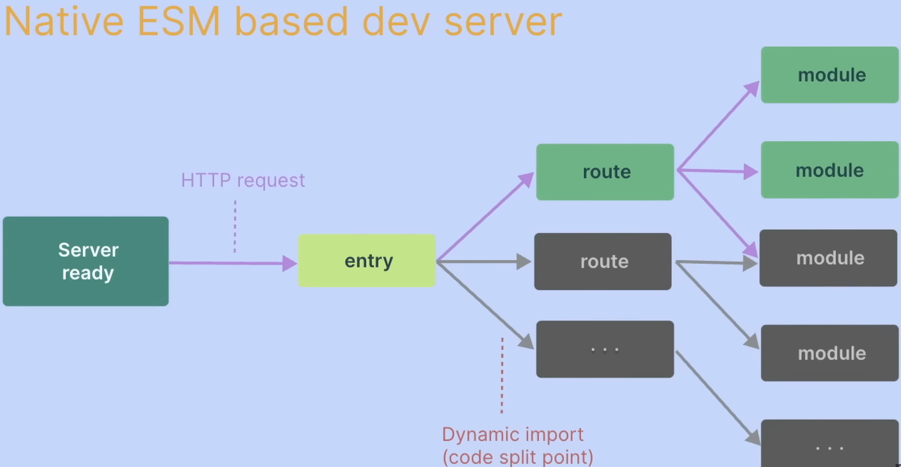
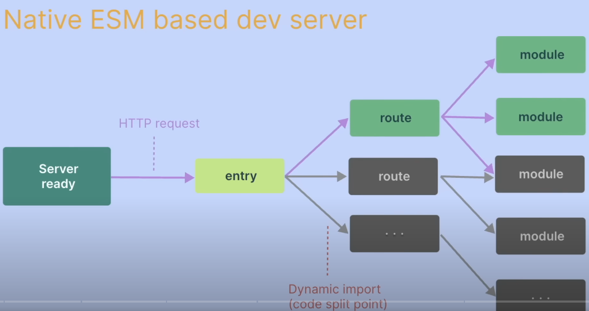

# vite-react

- it helps to create boiler plates for your projects
- replace CRA and balzing fast reload regardless of app size
- supports typescript, jsx, css
- minimum 14.18 node is required
- CRA downloads many dependencies including webpack, so slow. vite only makes project structure. so fast


this makes slow bundling. slow hotreloading


in vite only required code is served and processed.vite uses dynamic import

```
npm install --save-dev vite
```

templates

- keep . as project name to create project in same folder

```
npm create vite
//or
npm create vite my-js-app -- --template vanilla
npm create vite my-vue-app -- --template vue
npm create vite . -- --template react
```

extra -- if you use npm 7+

```
npm create vite my-js-app -- --template vanilla
npm create vite . -- --template react
npm install
```

```
//vite-template-vanilla
npm install -D tailwindcss postcss autoprefixer
npx tailwindcss init -p  #adds tailwind.config.cjs
```

for tailwind add below in styles.css

```
@tailwind base;
@tailwind components;
@tailwind utilities;
```

react tailwind

```
npm create vite vite-template-react-tailwind -- --template react
npm install -D tailwindcss postcss autoprefixer
npx tailwindcss init -p  #adds tailwind.config.cjs

```

environment

```
.env                loaded in all cases
.env.local          loaded in all cases, ignored by git
.env.[mode]         only loaded in specific mode
.env.[mode].local   only loaded in specific mode, ignored byt git

you must have "VITE_" for env variable

VITE_ABC = jack
```

- env file with more specific mode takes high priority and overrides
- .env.deveopment.local overrides .env
- variables in scripts package json have highest priority

configuration

```
* add conditional based url based on mode in vite.config.js
* third party api call
```
